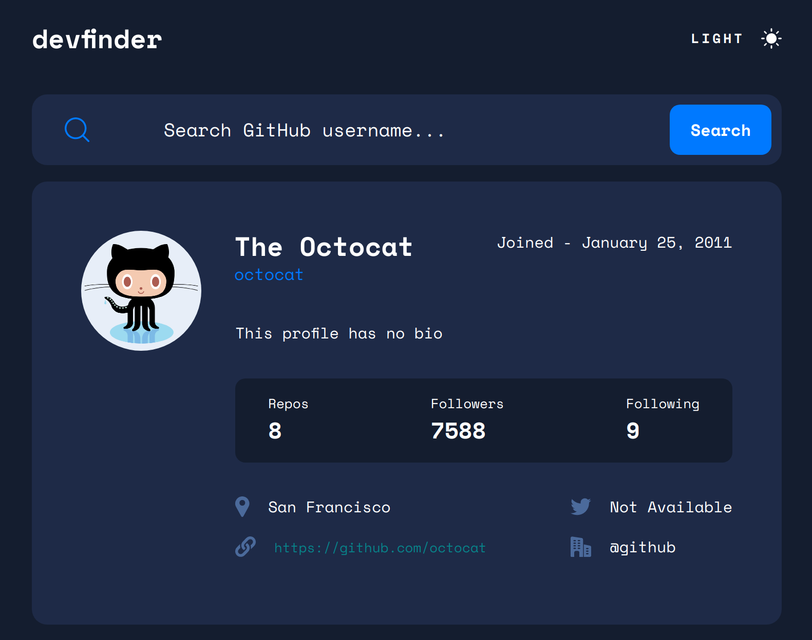

# Frontend Mentor - GitHub user search app solution

This is a solution to the [GitHub user search app challenge on Frontend Mentor](https://www.frontendmentor.io/challenges/github-user-search-app-Q09YOgaH6). Frontend Mentor challenges help you improve your coding skills by building realistic projects.

## Table of contents

- [Overview](#overview)
  - [The challenge](#the-challenge)
  - [Screenshot](#screenshot)
  - [Links](#links)
- [My process](#my-process)
  - [Built with](#built-with)
- [Author](#author)

## Overview

### The challenge

Challenge is to build out this GitHub user search app using the [GitHub users API](https://docs.github.com/en/rest/reference/users#get-a-user).

Users should be able to:

- View the optimal layout for the app depending on their device's screen size
- See hover states for all interactive elements on the page
- Search for GitHub users by their username
- See relevant user information based on their search
- Switch between light and dark themes

### Screenshot

Device 375px/700px/1440px

### Links

- Solution URL: [GitHub](https://github.com/Giorgi-Jalali/github-user-search-app-react/tree/master)
- Live Site URL: [GitHub Pages](http://giorgi-jalali.github.io/github-user-search-app-react)

## My process

### Built with

- CSS custom properties
- Flexbox
- Mobile-first workflow
- Fetch API
- [React](https://reactjs.org/) - JS library
- [Styled Components](https://styled-components.com/) - For styles

## Author

- LinkedIn - [Giorgi Jalali](https://www.linkedin.com/in/giorgi-jalali-0336b8225/)
